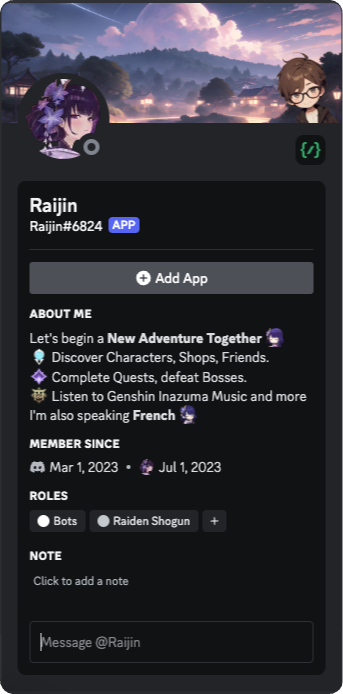

# Raijin Discord Bot

## Discover Raijin
<procedure>
    
Hello Adventurer ! I'm Raijin, your new Discord bot companion (You can't choose). Inspired by the real Genshin Impact game, my mission is to bring a fresh adventure to your Discord experience. I can even fetch your personal information from the real game. Embark on a new journey with me and our guide (His name is Makoto) as we explore a new island inspired by Genshin Impact. Get ready for an exciting adventure !

</procedure>
This place is going to teach you how to interact with me and Makoto to have a great journey !

You are going to discover how to configure Raijin and interact with all the different commands.
Every new command or feature is added in this documentation when it's released on Discord.
This documentation is currently the only way to have information about Raijin. 

We are working on a website to be out soon ;)

## Inviting Raijin
<a href="https://discord.com/oauth2/authorize?client_id=1080594936442933272&permissions=8&integration_type=0&scope=bot+applications.commands">Add Raijin</a>
with this button or through another server where Raijin is by clicking on the `Add App` button on Raijin profile.

    

